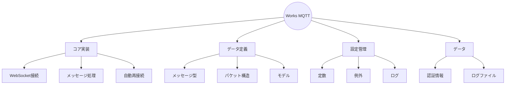

# Works MQTT WebSocket Client

## プロジェクト概要



## コアモジュール

### wmqtt.py - メインクライアント実装

#### 機能

- WebSocket接続の確立と維持
- メッセージの送受信処理
- 自動再接続メカニズム

#### クラス構成

| クラス名          | 説明                        |
| ----------------- | --------------------------- |
| `WMQTTClient`     | WebSocketクライアントの中核 |
| `MQTTConfig`      | MQTT接続パラメータ          |
| `WebSocketConfig` | WebSocket接続設定           |
| `StatusFlag`      | ユーザーステータス管理      |

## データ定義モジュール

### message_types.py - メッセージ定義

#### 列挙型

| 型名          | 用途                   |
| ------------- | ---------------------- |
| `MessageType` | メッセージの種類を定義 |
| `ChannelType` | チャンネルの種類を定義 |

### mqtt_packet.py - パケット構造

#### クラス構成

| クラス名          | 説明                 |
| ----------------- | -------------------- |
| `MQTTPacket`      | パケットの生成と処理 |
| `MQTTHeader`      | ヘッダー情報の管理   |
| `MQTTMessageType` | パケットタイプの定義 |

### models.py - データモデル

| クラス名       | 説明                         |
| -------------- | ---------------------------- |
| `WorksMessage` | メッセージ構造とシリアライズ |

### sticker_types.py - スタンプ定義

| クラス名      | 説明                     |
| ------------- | ------------------------ |
| `StickerType` | スタンプの種類の定義     |
| `StickerInfo` | スタンプのメタデータ管理 |

## 設定モジュール

### constants.py - 定数定義

#### 設定グループ

| グループ       | 内容                       |
| -------------- | -------------------------- |
| WebSocket設定  | エンドポイント、ヘッダー   |
| MQTT設定       | タイムアウト、リトライ間隔 |
| メッセージ定義 | フィールド、フォーマット   |

### exceptions.py - 例外定義

#### 例外階層

| 例外クラス            | 用途                 |
| --------------------- | -------------------- |
| `WorksError`          | 基本例外クラス       |
| `ConfigError`         | 設定関連エラー       |
| `ConnectionError`     | 接続関連エラー       |
| `AuthenticationError` | 認証関連エラー       |
| `MessageError`        | メッセージ処理エラー |
| `PacketError`         | パケット処理エラー   |
| `CookieError`         | クッキー関連エラー   |

### logging_config.py - ログ設定

#### 設定内容

| 項目           | 説明                 |
| -------------- | -------------------- |
| ログレベル     | ログの重要度管理     |
| Rich設定       | 出力フォーマット設定 |
| ローテーション | ログファイル管理設定 |

## データファイル

### cookie.json - 認証情報

#### 内容

- セッショントークン
- 認証情報
- JSONフォーマット

### works_mqtt.log - ログファイル

#### 記録内容

- デバッグ情報
- エラー情報
- メッセージ履歴

## システム構成

### 依存関係

```mermaid graph LR
A[wmqtt.py] --> B[constants.py]
A --> C[exceptions.py]
A --> D[logging_config.py]
A --> E[message_types.py]
A --> F[models.py]
A --> G[mqtt_packet.py]
A --> H[sticker_types.py]
F --> E
H --> E
```

### 処理フロー

```mermaid sequenceDiagram
    participant Client as WMQTTClient
    participant WebSocket
    participant MQTT as MQTTService

    Client->>WebSocket: WebSocket接続
    WebSocket-->>Client: 接続確立
    Client->>MQTT: CONNECT
    MQTT-->>Client: CONNACK

    loop キープアライブ
        Client->>MQTT: PINGREQ
        MQTT-->>Client: PINGRESP
    end

    MQTT->>Client: PUBLISH
    Client->>MQTT: PUBACK

    Note over Client: メッセージ処理
```
