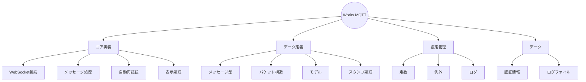
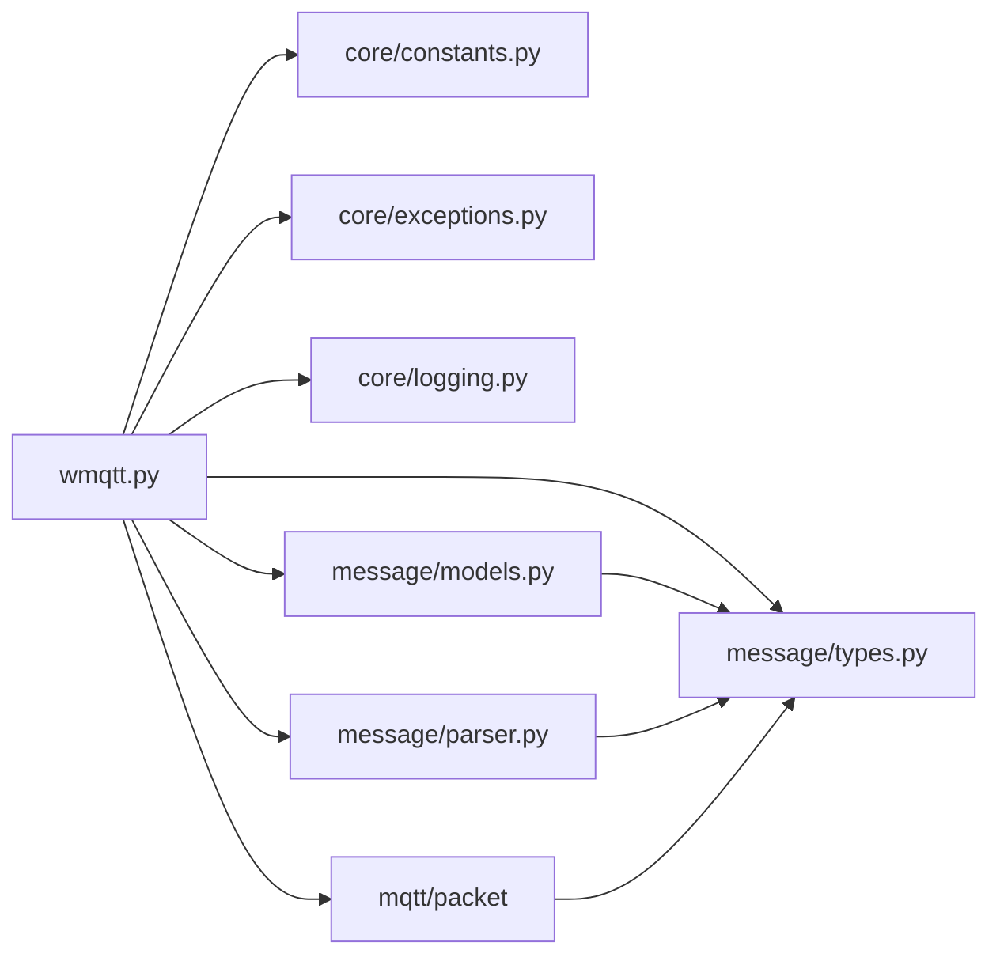
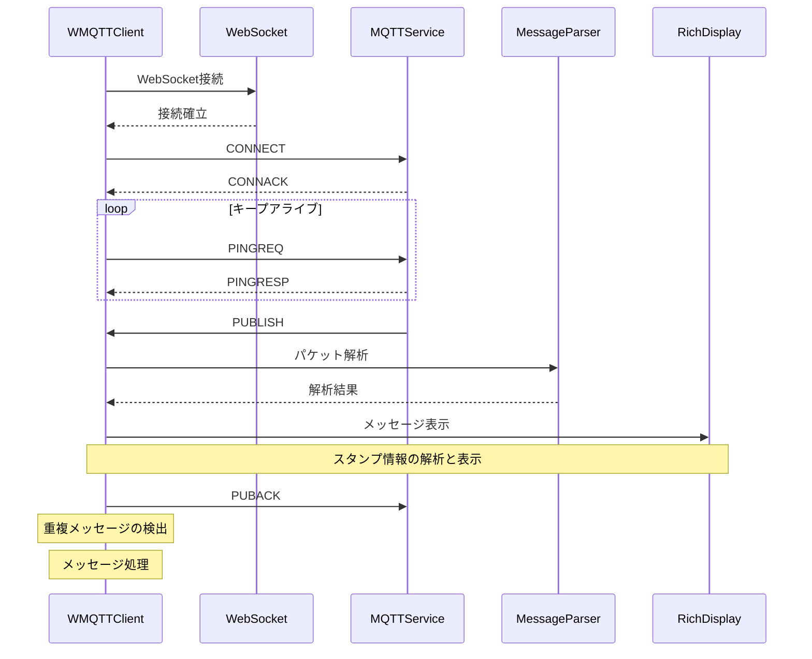

# Works MQTT WebSocket Client

## ディレクトリ構造

```
works-wss/
├── core/
│   ├── __init__.py
│   ├── constants.py
│   ├── exceptions.py
│   └── logging.py
├── message/
│   ├── __init__.py
│   ├── models.py
│   ├── parser.py
│   └── types.py
├── mqtt/
│   ├── packet/
│   │   ├── __init__.py
│   │   ├── base.py
│   │   ├── builder.py
│   │   ├── parser.py
│   │   └── types.py
│   └── __init__.py
├── wmqtt.py
├── STRUCTURE.md
├── README.md
├── LICENSE
├── .gitignore
├── cookie.json
├── works_mqtt.log
└── pyproject.toml
```

## プロジェクト概要



## コアモジュール

### wmqtt.py - メインクライアント実装

#### 機能

- WebSocket接続の確立と維持
- メッセージの送受信処理
- 自動再接続メカニズム
- リッチな表示処理
- 重複メッセージの検出と処理
- スタンプ情報の解析と表示

#### クラス構成

| クラス名          | 説明                        |
| ----------------- | --------------------------- |
| `WMQTTClient`     | WebSocketクライアントの中核 |
| `MQTTConfig`      | MQTT接続パラメータ          |
| `WebSocketConfig` | WebSocket接続設定           |

## データ定義モジュール

### message/types.py - メッセージ定義

#### 列挙型

| 型名          | 用途                   |
| ------------- | ---------------------- |
| `MessageType` | メッセージの種類を定義 |
| `ChannelType` | チャンネルの種類を定義 |
| `StickerType` | スタンプの種類を定義   |

#### データクラス

| クラス名      | 説明               |
| ------------- | ------------------ |
| `StickerInfo` | スタンプ情報の管理 |

### message/parser.py - メッセージ解析

| 関数名          | 説明                   |
| --------------- | ---------------------- |
| `parse_message` | メッセージデータの解析 |

### mqtt/packet - パケット構造

#### クラス構成

| クラス名     | 説明                 |
| ------------ | -------------------- |
| `MQTTPacket` | パケットの基本構造   |
| `PacketType` | パケットタイプの定義 |

#### 主要機能

| モジュール   | 説明                 |
| ------------ | -------------------- |
| `base.py`    | パケット基本クラス   |
| `builder.py` | パケット生成機能     |
| `parser.py`  | パケット解析機能     |
| `types.py`   | パケット関連の型定義 |

### message/models.py - データモデル

| クラス名       | 説明                         |
| -------------- | ---------------------------- |
| `WorksMessage` | メッセージ構造とシリアライズ |

## 設定モジュール

### core/constants.py - 定数定義

#### 設定グループ

| グループ       | 内容                       |
| -------------- | -------------------------- |
| WebSocket設定  | エンドポイント、ヘッダー   |
| MQTT設定       | タイムアウト、リトライ間隔 |
| メッセージ定義 | フィールド、フォーマット   |

### core/exceptions.py - 例外定義

#### 例外階層

| 例外クラス            | 用途                 |
| --------------------- | -------------------- |
| `WorksError`          | 基本例外クラス       |
| `ConfigError`         | 設定関連エラー       |
| `ConnectionError`     | 接続関連エラー       |
| `AuthenticationError` | 認証関連エラー       |
| `MessageError`        | メッセージ処理エラー |
| `PacketError`         | パケット処理エラー   |
| `CookieError`         | クッキー関連エラー   |

### core/logging.py - ログ設定

#### 設定内容

| 項目           | 説明                       |
| -------------- | -------------------------- |
| ログレベル     | ログの重要度管理           |
| Rich設定       | 出力フォーマット設定       |
| パネル表示     | 構造化されたメッセージ表示 |
| ローテーション | ログファイル管理設定       |

## データファイル

### cookie.json - 認証情報

#### 内容

- セッショントークン
- 認証情報
- JSONフォーマット

### works_mqtt.log - ログファイル

#### 記録内容

- デバッグ情報
- エラー情報
- メッセージ履歴
- パケット解析情報

## システム構成

### 依存関係



### 処理フロー


